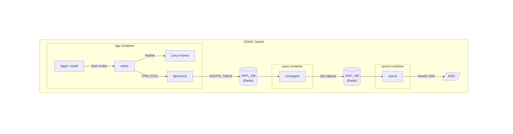
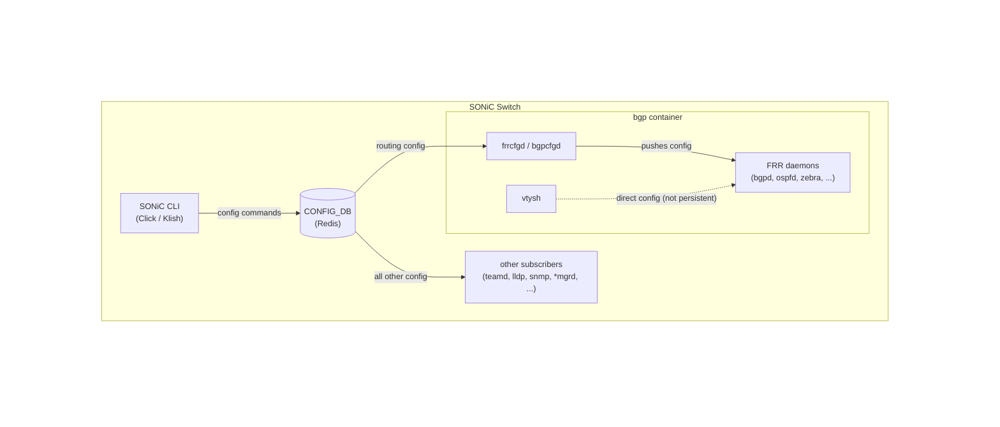

# FRR in SONiC

In a standard Linux environment, FRR's job is finished once it hands a route to the Linux kernel. However, SONiC is designed to run on high-performance network switches. Therefore, the ultimate goal in SONiC is not just to update the Linux kernel, but to program those routes directly into the physical hardware chip (the ASIC) so the switch can forward data at line-rate speeds.

Because understanding this hardware-forwarding goal is essential to understanding how SONiC modifies and manages FRR, we will start with the architecture and data flow before diving into how SONiC actually builds and configures the software.

## The Route's Journey

In SONiC, FRR lives inside a dedicated Docker container called the `bgp` container. When FRR learns a new route from a neighboring router, it must send that route down a specialized pipeline to reach the hardware ASIC.

Here is the step-by-step journey of a route in SONiC:

- **Learning the Route**: The FRR protocol daemons (like `bgpd` or `ospfd`) learn a route and pass it to Zebra (FRR’s core manager).

- **The Split Path**: Zebra does two things simultaneously:

    - It uses Netlink to install the route into the standard Linux Kernel (for local control-plane traffic).
    - It uses a TCP socket called the Forwarding Plane Manager (FPM) to send the route to a SONiC-specific daemon called `fpmsyncd`.

- **Entering the Database**: `fpmsyncd` acts as a translator. It takes the route from Zebra and writes it into SONiC's central Redis database (specifically, the `APPL_DB` or Application Database).

- **Translation for Hardware**: In the `swss` (Switch State Service) container, `orchagent` subscribes to `APPL_DB`. When it sees the new route, it translates it into `SAI` (Switch Abstraction Interface) objects and writes them to a second Redis database called `ASIC_DB`.

- **Programming the ASIC**: In the `syncd` container, the `syncd` daemon reads from `ASIC_DB`, translates virtual object IDs to real hardware IDs, and calls the vendor SAI library to program the physical ASIC. The route is now in hardware, allowing the switch to forward traffic at line rate without involving the CPU.

## Managing Configuration

Because SONiC relies on a central Redis database (the ConfigDB) as its "single source of truth," managing FRR introduces a unique challenge: the Split Brain Problem. FRR has its own traditional command-line interface called `vtysh`. If a network engineer logs into `vtysh` and creates a route, FRR knows about it, but the SONiC Redis database does not. If the switch reboots, that route will be lost forever. To solve this, SONiC allows administrators to operate in two distinct modes:

### Unified Mode (The Default & Recommended Path)

In Unified Mode, CONFIG_DB is the single source of truth. The user configures the switch through the SONiC CLI (Click or Klish), and every command is written to CONFIG_DB.

**At Boot:** A tool called `sonic-cfggen` reads the saved CONFIG_DB and generates the initial FRR startup files (`frr.conf`, `bgpd.conf`, etc.), so the routing daemons come up with the correct configuration without any manual intervention.

**At Runtime:** When a user makes a change through the CLI, CONFIG_DB is updated and its subscribers react:

- For routing configuration (BGP neighbors, OSPF areas, route maps, etc.), a background daemon called `frrcfgd` (or `bgpcfgd` in older versions) monitors CONFIG_DB inside the bgp container. When it detects a routing change, it translates it and pushes the configuration directly into the running FRR daemons. FRR then installs the resulting routes through the FPM pipeline described in the previous section.

- All other configuration (ports, interfaces, VLANs, LAG, LLDP, SNMP, DHCP, system settings, etc.) is picked up by their respective subscribers. Each watches CONFIG_DB and applies changes within its own scope.

You can still use `vtysh` to inspect the routing table or test configuration changes (shown as the dashed line in the diagram), but any changes made through `vtysh` bypass CONFIG_DB entirely. This means they will not survive a reboot or a container restart — only configuration that flows through CONFIG_DB is persistent.

### Split Mode (For Advanced Use Cases)

In Split Mode, you intentionally break the synchronization link between SONiC and FRR. The `frrcfgd` daemon stops pushing updates to FRR. You manage your physical ports and IP addresses via SONiC, but you manage your routing protocols entirely through FRR's `vtysh` shell, saving the configuration directly to an `frr.conf` file (just like a standard Linux server).

If you need to deploy highly complex routing topologies, deep OSPF tweaks, or advanced route maps that the SONiC management framework doesn't officially support yet, Split Mode gives you direct, unhindered access to the underlying routing engine. It is also highly preferred by engineers who want to stick strictly to traditional industry CLIs.

## How SONiC Builds FRR

Because SONiC needs FRR to talk to its internal databases and handle specific datacenter requirements, it cannot just download the standard, off-the-shelf version of FRR. Instead, it builds a customized version from scratch during the SONiC image creation process.

- **Clone**: SONiC maintains its own specialized fork of the FRR repository called [sonic-frr](https://github.com/sonic-net/sonic-frr). This repository tracks a specific stable release of the upstream FRR project and is pulled in as a Git submodule during the build.

- **Patch**: Before compiling, SONiC applies a series of custom patches to the FRR source code. These patches inject SONiC-specific behaviors that aren't available in the standard version, such as custom BGP DSCP handling, VRF (Virtual Routing and Forwarding) tweaks, and the specific integration hooks required to communicate with SONiC's database.

- **Build**: The patched source code is then compiled into several standard Debian (.deb) packages:

    - `frr`: The core daemons (zebra, bgpd, etc.)
    - `frr-pythontools`: Python utility scripts
    - `frr-snmp`: SNMP support for network monitoring
    - `frr-dbgsym`: Debugging symbols for troubleshooting

- **Package into Docker**: Finally, these packages are installed into the `docker-fpm-frr` Docker image (which becomes the `bgp` container on the switch). Crucially, SONiC bundles FRR alongside essential helper tools, including `fpmsyncd` (to talk to the database), configuration sync daemons (`bgpcfgd` / `frrcfgd`), and traffic-shifting utilities.
