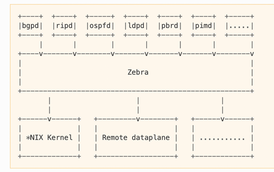

# FRRouting

FRR runs on all modern *NIX operating systems, including Linux and the BSDs, and is distributed under GPLv2. You can check the feature matrix in [here](https://docs.frrouting.org/en/stable-10.2/about.html#feature-matrix). FRR git repository is in [here](https://github.com/FRRouting/frr).

FRR is widely used in network environments for its flexibility, performance, and support for a broad range of routing protocols. It is designed to be modular, allowing users to enable or disable specific routing protocols as needed. It integrates well with the Linux networking stack, leveraging its capabilities to provide efficient and scalable routing solutions.

FRR is maintained by a community of developers and is part of the Linux Foundation's networking projects. It has extensive documentation and active community support, making it accessible for both beginners and experienced network engineers. It is actively used in production by hundreds of companies, universities, research labs and governments.

FRR started as a fork of [Quagga](https://github.com/Quagga/quagga) in 2016 due to perceived stagnation in Quagga's development. Quagga is an open-source routing software that was a fork of the older Zebra project. It has been used widely for implementing network routing protocols in Unix-based systems. It supports essential routing protocols like BGP, OSPF, RIP, and IS-IS but lacks some of the newer features and improvements found in FRR.


## Data Plane vs. Control Plane

To truly grasp how FRR functions, it helps to view networking through a fundamental division of labor: the separation of the control plane and the data plane.

### The Linux Kernel: Data Plane

At the heart of the operation is your Linux operating system, which acts as the data plane. The kernel is responsible for the actual, high-speed movement of data. Whenever a network packet arrives at a physical or virtual network interface, the kernel consults its internal routing table to determine the correct exit interface. It handles the heavy lifting of packet forwarding, ensuring data reaches its next hop efficiently. However, it operates strictly on the information it has been given; it requires an accurate, up-to-date routing table to make correct forwarding decisions.

### FRRouting: Control Plane

FRR operates entirely in the control plane as a modular suite of userspace daemons. It does not forward packets itself. Its role is protocol communication and path computation — it runs routing protocols (such as OSPF, BGP, or IS-IS) with neighboring routers, exchanging information about the broader network topology. Once FRR determines the optimal paths to each destination, it programs those routes directly into the Linux kernel’s routing table.


## Netlink and Zebra

Now that we know FRR learns the routes and the Linux kernel forwards the traffic, how do they communicate?

### Netlink (The Communication Channel)

FRR and the Linux kernel operate in two separate memory domains. The kernel runs in kernel space, a protected execution environment, while FRR runs in userspace. Because they are separated by this privilege boundary, they require a structured inter-process communication mechanism to exchange routing information.

That mechanism is Netlink. Netlink is a high-performance, bidirectional socket-based IPC built into the Linux kernel. It provides a structured messaging interface between userspace processes and the kernel networking subsystem. Communication flows in both directions:

- **FRR → Kernel:** Install, update, or delete routes in the kernel routing table.
- **Kernel → FRR:** Notify FRR of interface state changes, address additions/removals, and other network events.

### Zebra (The Route Manager)

FRR is modular, with each routing protocol implemented as a separate daemon. When multiple protocols (such as OSPF and BGP) are running concurrently, their route updates must be coordinated before being pushed to the kernel. This is the role of the core daemon called Zebra.

- Individual protocol daemons (like ospfd or bgpd) calculate their routes and hand them to Zebra.
- Zebra selects the best route when multiple protocols offer paths to the same destination, based on administrative distance.
- Zebra is the sole daemon that communicates with the kernel via Netlink to install the selected routes.




## FRR Protocol Daemons

Because FRR is modular, if one routing protocol crashes, it won't take down the others. You only turn on the daemons you actually need. Here is the breakdown of the daemons available in FRR:

Core Infrastructure

| Daemon       | Description                                                                                                                                 |
| ------------ | ------------------------------------------------------------------------------------------------------------------------------------------- |
| **zebra**    | Core routing manager. Installs routes into the Linux kernel, manages interfaces, VRFs, nexthops, and provides an API for all other daemons. |
| **watchfrr** | Supervisor process that monitors and restarts FRR daemons if they crash.                                                                    |
| **staticd**  | Handles static routes configuration and pushes them to zebra.                                                                               |
| **mgmtd**    | Centralized management daemon (newer architecture replacing older vtysh-only management approach).                                          |

IGP – Distance Vector Protocols

| Daemon     | Description                                                                                                                                              |
| ---------- | -------------------------------------------------------------------------------------------------------------------------------------------------------- |
| **ripd**   | RIP for IPv4. Classic distance-vector protocol using hop count metric (max 15).                                                                          |
| **ripngd** | RIPng for IPv6. Same distance-vector behavior as RIP but for IPv6.                                                                                       |
| **babeld** | Babel protocol. Advanced distance-vector protocol with fast convergence and loop-avoidance improvements. Often used in mesh and dual-stack environments. |
| **eigrpd** | EIGRP. Technically an advanced distance-vector. Uses DUAL algorithm and maintains topology information.                                                  |

IGP – Link-State Protocols

| Daemon      | Description                                                                                  |
| ----------- | -------------------------------------------------------------------------------------------- |
| **ospfd**   | OSPFv2 (IPv4) link-state routing protocol. Builds LSDB and runs SPF.                         |
| **ospf6d**  | OSPFv3 (IPv6) link-state routing protocol.                                                   |
| **isisd**   | IS-IS link-state routing protocol supporting IPv4 and IPv6.                                  |
| **fabricd** | OpenFabric. Lightweight IS-IS–derived link-state protocol optimized for data center fabrics. |

EGP - Path Vector Protocols

| Daemon   | Protocol | Description                                                                                       |
| -------- | -------- | ------------------------------------------------------------------------------------------------- |
| **bgpd** | BGP      | Border Gateway Protocol for inter-domain routing, supports iBGP, eBGP, EVPN, VPNv4/v6, MPLS, etc. |

Fast Failure Detection Protocols

| Daemon   | Protocol | Description                                                                                           |
| -------- | -------- | ----------------------------------------------------------------------------------------------------- |
| **bfdd** | BFD      | Bidirectional Forwarding Detection. Lightweight protocol for fast failure detection between routers.  |

Multicast Routing

| Daemon    | Description                                                                       |
| --------- | --------------------------------------------------------------------------------- |
| **pimd**  | PIM-SM (Protocol Independent Multicast – Sparse Mode) for IPv4 multicast routing. |
| **pim6d** | PIM for IPv6 multicast.                                                           |

MPLS and Segment Routing

| Daemon    | Description                                                    |
| --------- | -------------------------------------------------------------- |
| **ldpd**  | LDP (Label Distribution Protocol) for MPLS label distribution. |
| **pathd** | Segment Routing (SR-TE) path computation and management.       |

Policy based Routing

| Daemon   | Description                                                                                                                                                        |
| -------- | ------------------------------------------------------------------------------------------------------------------------------------------------------------------ |
| **pbrd** | Applies match/action rules (source IP, destination IP, ports, interfaces, DSCP, etc.) to steer traffic based on policy rather than pure destination-based routing. |

Overlay / NBMA & Tunneling

| Daemon    | Description                                                                                                                              |
| --------- | ---------------------------------------------------------------------------------------------------------------------------------------- |
| **nhrpd** | Next Hop Resolution Protocol daemon. Used in DMVPN-style hub-and-spoke or NBMA overlay networks to dynamically resolve tunnel endpoints. |

High Availability

| Daemon    | Description                                                                |
| --------- | -------------------------------------------------------------------------- |
| **vrrpd** | Implements VRRP (Virtual Router Redundancy Protocol) for gateway failover. |

SNMP / Management

| Daemon    | Description                                                                                        |
| --------- | -------------------------------------------------------------------------------------------------- |
| **snmpd** | SNMP support for FRR (if enabled).                                                                 |

Testing and Route Injection Tools

| Daemon     | Description                                                                 |
| ---------- | --------------------------------------------------------------------------- |
| **sharpd** | Used for testing and injecting routes (primarily debugging/testing).        |


## Management and Configuration (vtysh)

All of the FRR daemons can be managed through a single integrated user interface shell called [vtysh](https://docs.frrouting.org/projects/dev-guide/en/latest/vtysh.html). vtysh connects to each daemon through a UNIX domain socket and then works as a proxy for user input. If you have ever used an enterprise hardware router (like Cisco), vtysh feels exactly the same.

In addition to a unified frontend, vtysh also provides the ability to configure all the daemons using a single configuration file through the integrated configuration mode. This avoids the overhead of maintaining a separate configuration file for each daemon.


## FRR Installation

You can install FRR from [packages](https://deb.frrouting.org/) or install it directly from the [source](https://docs.frrouting.org/en/latest/installation.html#from-source).

Once the installation is finished, make sure the frr service is up and running:

```bash
systemctl status frr
```

The `watchfrr`, `zebra`, and `static` daemons are always running. The `watchfrr` is a daemon that monitors the health and status of the other FRR daemons. It is primary responsible for monitoring, restarting, and notification. The `static` daemon is responsible for managing static routes within the FRR suite. It interacts with `zebra` to ensure that the static routes are properly integrated with other dynamic routing protocols and the overall routing table.

Add your username into the frr group, and restart the system for the changes to take effect.

```bash
sudo usermod -a -G frr <username>
```

Open the FRR daemon file with the editor of your choice:

```bash
sudo nano /etc/frr/daemons
```

And enable/disable daemons. For example, you can enable OSPF daemon by setting `ospf=yes` in that file. Once you save the file, restart the frr service.

```bash
systemctl restart frr
```

`vtysh` is a CLI shell provided by FRR that allows network administrators to interact with multiple FRR daemons through a single, unified command interface. It is modeled after the CLI used in many enterprise-grade networking devices, making it familiar to network engineers.

```bash
sudo vtysh
```

Display the list of interfaces:

```bash
frr# show interface brief

Interface       Status  VRF          Addresses
---------       ------  ---          ---------
enp0s3          up      default      10.0.2.15/24
                                     fe80::b1b9:972d:5028:45cb/64
lo              up      default
```

Display the current routing table:

```bash
frr# show ip route

Codes: K - kernel route, C - connected, L - local, S - static,
       R - RIP, O - OSPF, I - IS-IS, B - BGP, E - EIGRP, N - NHRP,
       T - Table, v - VNC, V - VNC-Direct, A - Babel, F - PBR,
       f - OpenFabric, t - Table-Direct,
       > - selected route, * - FIB route, q - queued, r - rejected, b - backup
       t - trapped, o - offload failure

K>* 0.0.0.0/0 [0/100] via 10.0.2.2, enp0s3, 00:17:12
L>* 10.0.2.15/32 is directly connected, enp0s3, 00:17:12
K>* 169.254.0.0/16 [0/1000] is directly connected, enp0s3, 00:17:12
```
