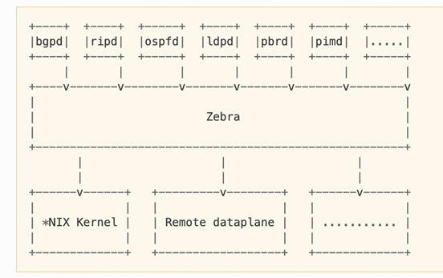
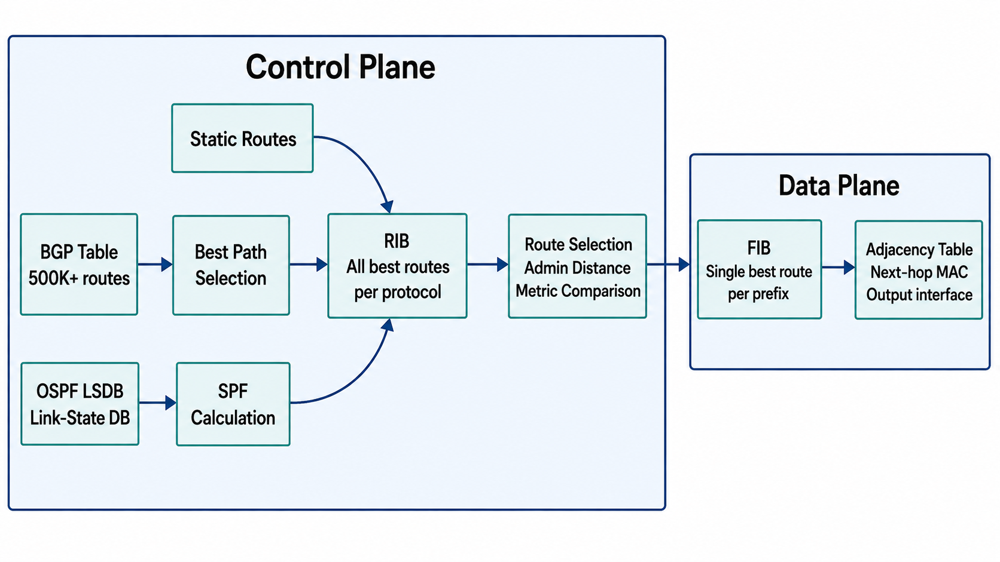

# FRRouting

FRRouting (FRR) is an open-source routing software suite for Linux and other Unix-like operating systems, including the BSDs. It implements the control plane for IP routing protocols, enabling a standard Linux machine to function as a full-featured network router. FRR is distributed under the GPLv2 license.

FRR is actively used in production by hundreds of companies, universities, research labs, and governments worldwide. It is maintained as part of the Linux Foundation's networking projects, with extensive documentation and an active community supporting both beginners and experienced network engineers.

You can explore the feature matrix [here](https://docs.frrouting.org/en/stable-10.2/about.html#feature-matrix) and the source code on [GitHub](https://github.com/FRRouting/frr).

### History

FRR started as a fork of [Quagga](https://github.com/Quagga/quagga) in 2016. Quagga was itself a fork of the earlier Zebra routing project. While Quagga supported essential protocols like BGP, OSPF, RIP, and IS-IS, its development had largely stagnated. FRR was created to continue active development, modernize the codebase, and add support for newer protocols and features.


## Data Plane vs. Control Plane

Understanding FRR requires grasping a fundamental networking concept: the separation between the **control plane** and the **data plane**. These two planes divide the work of routing into distinct responsibilities.

- The **control plane** decides *where* traffic should go by exchanging routing information with other routers and computing the best paths.
- The **data plane** performs the actual *forwarding* of packets based on those decisions.

### The Linux Kernel (Data Plane)

The Linux kernel acts as the data plane. When a network packet arrives at an interface, the kernel consults its routing table to determine the correct outgoing interface and forwards the packet accordingly. The kernel handles packet forwarding at high speed, but it relies entirely on its routing table being accurate and up to date — it does not discover routes on its own.

### FRRouting (Control Plane)

FRR operates as the control plane. It runs routing protocols (such as OSPF, BGP, or IS-IS) to exchange topology information with neighboring routers. After computing the optimal paths to each destination, FRR programs those routes into the Linux kernel's routing table. FRR itself never touches the packets — it only instructs the kernel on how to forward them.


## Netlink and Zebra

The previous sections established that FRR learns routes (control plane) and the Linux kernel forwards traffic (data plane). This section explains how the two communicate.

### Netlink (The Communication Channel)

FRR runs in **userspace** (ordinary application memory), while the Linux kernel runs in **kernel space** (a protected, privileged memory environment). Because they operate in separate memory domains separated by a privilege boundary, they need a structured communication mechanism to exchange routing information.

That mechanism is **Netlink** — a high-performance, bidirectional socket interface built into the Linux kernel for communication between userspace processes and kernel subsystems. Messages flow in both directions:

- **FRR → Kernel:** Install, update, or delete routes in the kernel routing table.
- **Kernel → FRR:** Notify FRR of interface state changes, address additions/removals, and other network events.

### Zebra (The Route Manager)

FRR is modular — each routing protocol runs as a separate process called a **daemon** (a long-running background service in Unix/Linux systems). When multiple protocol daemons (such as OSPF and BGP) run simultaneously, their route updates must be coordinated before being pushed to the kernel. This coordination is handled by a central daemon called **Zebra**.

Zebra acts as FRR's internal route manager:

1. Protocol daemons (like `ospfd` or `bgpd`) calculate their best routes and submit them to Zebra.
2. When multiple protocols offer routes to the same destination, Zebra selects the best one using **administrative distance** (explained in the next section).
3. Zebra is the only daemon that communicates with the kernel via Netlink to install the selected routes.




## Administrative Distance

When multiple routing protocols each provide a route to the same destination, Zebra must choose which one to install. It does so using **administrative distance** (AD) — a numeric priority value assigned to each routing source. A lower AD indicates a more trusted source. For example, if both OSPF (AD 110) and RIP (AD 120) advertise a route to `10.1.0.0/24`, Zebra selects the OSPF route because it has the lower AD.

Common default values in FRR:

| Source     | Default AD |
| ---------- | ---------- |
| Connected  | 0          |
| Static     | 1          |
| eBGP       | 20         |
| EIGRP      | 90         |
| OSPF       | 110        |
| IS-IS      | 115        |
| RIP        | 120        |
| iBGP       | 200        |


## RIB and FIB

The RIB and FIB are two routing tables that make the control plane / data plane separation concrete.



### RIB (Routing Information Base)

The RIB is the control plane's routing table, maintained by Zebra. It stores every route that any source has offered — OSPF-learned routes, BGP-learned routes, static routes, directly connected interfaces, and more. When multiple sources provide a route to the same destination, Zebra compares their administrative distance and selects the best one. The winning route is marked with `>` (selected) in the `show ip route` output and is installed into the FIB.

You can view the RIB with:

```bash
frr# show ip route
```

### FIB (Forwarding Information Base)

The FIB is the data plane's routing table — the table the Linux kernel actually consults when a packet arrives and needs to be forwarded. It contains only the winning routes from the RIB: the entries that Zebra has installed into the kernel via Netlink.

Routes present in the FIB are marked with `*` (FIB route) in the `show ip route` output. You can also view the FIB directly through the kernel:

```bash
ip route
```

### How They Work Together

```
Protocol daemons ──► Zebra (RIB) ──Netlink──► Linux Kernel (FIB) ──► forwards packets
(ospfd, bgpd, …)     selects best              stores winning        looks up destination,
                      route per                 routes for            sends packet out the
                      destination               forwarding            correct interface
```

1. Each protocol daemon (ospfd, bgpd, etc.) calculates its routes and submits them to Zebra.
2. Zebra stores all candidate routes in the RIB and selects the best route for each destination.
3. Zebra programs the selected routes into the kernel's FIB via Netlink.
4. When a packet arrives, the kernel looks up the destination in the FIB and forwards it accordingly.

The RIB may contain routes that are *not* in the FIB — for example, a less-preferred BGP route that lost to an OSPF route for the same prefix. These backup routes remain in the RIB so that if the preferred route is withdrawn, Zebra can immediately promote the next-best route to the FIB without waiting for a full protocol re-convergence.


## FRR Protocol Daemons

Because each protocol runs as an independent daemon, a crash in one does not affect the others. You only enable the daemons you need.

An **Autonomous System (AS)** is a network or group of networks under a single administrative authority, such as a company or ISP. Routing protocols are categorized based on whether they operate within a single AS or between multiple ASes:

- **IGP (Interior Gateway Protocol):** Operates within a single AS to distribute routes among internal routers.
- **EGP (Exterior Gateway Protocol):** Operates between different ASes to exchange routes across organizational boundaries.

### Core Infrastructure

| Daemon       | Description                                                                                                                                 |
| ------------ | ------------------------------------------------------------------------------------------------------------------------------------------- |
| **zebra**    | Core routing manager. Installs routes into the Linux kernel, manages interfaces, VRFs, nexthops, and provides an API for all other daemons. |
| **watchfrr** | Supervisor daemon that monitors all other FRR daemons and automatically restarts any that crash.                                            |
| **staticd**  | Handles static route configuration and submits static routes to Zebra.                                                                     |
| **mgmtd**    | Centralized management daemon (newer architecture for unified daemon management).                                                           |

### IGP — Distance-Vector Protocols

Distance-vector protocols determine the best path based on a simple metric (typically hop count) and share routing information only with directly connected neighbors.

| Daemon     | Description                                                                                                                                               |
| ---------- | --------------------------------------------------------------------------------------------------------------------------------------------------------- |
| **ripd**   | RIP for IPv4. Classic distance-vector protocol using hop count as its metric (maximum 15 hops).                                                           |
| **ripngd** | RIPng for IPv6. Same distance-vector approach as RIP, adapted for IPv6.                                                                                   |
| **babeld** | Babel protocol. An advanced distance-vector protocol with fast convergence and loop-avoidance mechanisms. Often used in mesh and dual-stack environments.  |
| **eigrpd** | EIGRP (Enhanced Interior Gateway Routing Protocol). Uses the DUAL algorithm and maintains topology information for faster convergence than classic RIP.    |

### IGP — Link-State Protocols

Link-state protocols build a complete map of the network topology called a Link-State Database (LSDB). Each router independently computes the shortest path to every destination using the SPF (Shortest Path First) algorithm.

| Daemon      | Description                                                                          |
| ----------- | ------------------------------------------------------------------------------------ |
| **ospfd**   | OSPFv2 for IPv4. Builds an LSDB and runs SPF to compute shortest paths.             |
| **ospf6d**  | OSPFv3 for IPv6.                                                                     |
| **isisd**   | IS-IS link-state routing protocol supporting both IPv4 and IPv6.                     |
| **fabricd** | OpenFabric. A lightweight IS-IS variant optimized for data center fabric topologies.  |

### EGP — Path-Vector Protocol

| Daemon   | Description                                                                                                     |
| -------- | --------------------------------------------------------------------------------------------------------------- |
| **bgpd** | BGP (Border Gateway Protocol). The standard protocol for inter-AS routing, supporting iBGP, eBGP, EVPN, VPNv4/v6, MPLS, and more. |

### Fast Failure Detection

| Daemon   | Description                                                                                                       |
| -------- | ----------------------------------------------------------------------------------------------------------------- |
| **bfdd** | BFD (Bidirectional Forwarding Detection). Lightweight protocol for sub-second failure detection between routers.  |

### Multicast Routing

| Daemon    | Description                                                                       |
| --------- | --------------------------------------------------------------------------------- |
| **pimd**  | PIM-SM (Protocol Independent Multicast – Sparse Mode) for IPv4 multicast routing. |
| **pim6d** | PIM for IPv6 multicast.                                                           |

### MPLS and Segment Routing

| Daemon    | Description                                                    |
| --------- | -------------------------------------------------------------- |
| **ldpd**  | LDP (Label Distribution Protocol) for MPLS label distribution. |
| **pathd** | Segment Routing (SR-TE) path computation and management.       |

### Policy-Based Routing

| Daemon   | Description                                                                                                                            |
| -------- | -------------------------------------------------------------------------------------------------------------------------------------- |
| **pbrd** | Steers traffic based on policy rules (source IP, destination IP, ports, DSCP, etc.) rather than destination-only routing table lookups. |

### Overlay and Tunneling

| Daemon    | Description                                                                                                            |
| --------- | ---------------------------------------------------------------------------------------------------------------------- |
| **nhrpd** | NHRP (Next Hop Resolution Protocol). Used in DMVPN-style hub-and-spoke overlays to dynamically resolve tunnel endpoints. |

### High Availability

| Daemon    | Description                                                                        |
| --------- | ---------------------------------------------------------------------------------- |
| **vrrpd** | VRRP (Virtual Router Redundancy Protocol) for automatic gateway failover.          |

### Monitoring

| Daemon    | Description                                   |
| --------- | --------------------------------------------- |
| **snmpd** | SNMP support for FRR (if compiled with SNMP). |

### Testing and Debugging

| Daemon     | Description                                                         |
| ---------- | ------------------------------------------------------------------- |
| **sharpd** | Internal testing daemon for route injection and debugging purposes. |


## Installation

FRR can be installed from [prebuilt packages](https://deb.frrouting.org/) or compiled directly from [source](https://docs.frrouting.org/en/latest/installation.html#from-source).

After installation, verify the FRR service is running:

```bash
systemctl status frr
```

The `watchfrr`, `zebra`, and `staticd` daemons run by default. To enable additional protocol daemons, edit the FRR daemons configuration file:

```bash
sudo nano /etc/frr/daemons
```

Set the desired daemon to `yes` (for example, `ospfd=yes` to enable OSPF), then restart the service:

```bash
systemctl restart frr
```

Add your user to the `frr` group so you can interact with FRR without root privileges. A logout or reboot is required for the change to take effect:

```bash
sudo usermod -a -G frr <username>
```


## Management and Configuration (vtysh)

All FRR daemons are managed through a unified command-line interface called **vtysh**. It connects to each daemon's UNIX domain socket and acts as a single entry point for configuration and monitoring. If you have used a Cisco or similar enterprise router CLI, vtysh will feel familiar.

vtysh also supports a single unified configuration file, eliminating the need to maintain separate configuration files for each daemon.

To open the vtysh shell:

```bash
sudo vtysh
```

Display network interfaces:

```bash
frr# show interface brief

Interface       Status  VRF          Addresses
---------       ------  ---          ---------
enp0s3          up      default      10.0.2.15/24
                                     fe80::b1b9:972d:5028:45cb/64
lo              up      default
```

Display the routing table:

```bash
frr# show ip route

Codes: K - kernel route, C - connected, L - local, S - static,
       R - RIP, O - OSPF, I - IS-IS, B - BGP, E - EIGRP, N - NHRP,
       T - Table, v - VNC, V - VNC-Direct, A - Babel, F - PBR,
       f - OpenFabric, t - Table-Direct,
       > - selected route, * - FIB route, q - queued, r - rejected, b - backup
       t - trapped, o - offload failure

K>* 0.0.0.0/0 [0/100] via 10.0.2.2, enp0s3, 00:17:12
L>* 10.0.2.15/32 is directly connected, enp0s3, 00:17:12
K>* 169.254.0.0/16 [0/1000] is directly connected, enp0s3, 00:17:12
```
