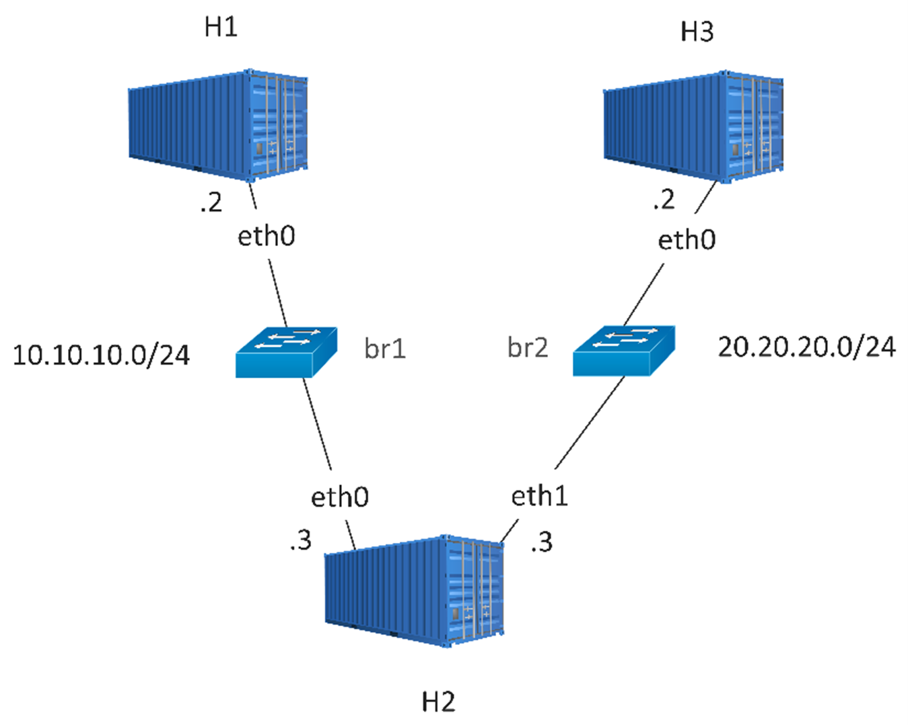

# FRR-LabNet

This project is a hands-on lab for learning FRRouting (FRR) using Docker containers. It spins up a small multi-homed topology with three containers running OSPF, letting you observe route learning, kernel route installation, and end-to-end forwarding without needing physical hardware. The setup is fully automated: build the image, bring up the containers, and OSPF converges on its own.

- For background on FRR itself see [FRRouting.md](FRRouting.md).
- For details on how FRR is integrated within the SONiC see [FRR_SONIC.md](FRR_SONIC.md).


## FRR Test Setup

We create three Ubuntu 20.04 containers with FRR for a small multi-homed lab topology.



Build the image:

```bash
docker build --tag frr-labnet .
```

Start the containers:

```bash
docker compose up -d
```

Compose creates two user-defined **bridge** networks with fixed subnets. Docker attaches a virtual Ethernet interface per network and picks an address from that subnet automatically, so you usually do not need to configure interface IPs by hand for the lab.

- **H1** is only on `br1`: one NIC (**eth0**) with an address in 10.10.10.0/24.

- **H3** is only on `br2`: one NIC (**eth0**) with an address in 20.20.20.0/24.

- **H2** is on both networks (listed as `br1` then `br2`): **eth0** on 10.10.10.0/24 and **eth1** on 20.20.20.0/24, so it can forward between the two segments once routing is up.

We use dynamic routing (for example OSPF) across the three containers. Each host uses normal Linux interfaces from the Docker bridges.


### Pre-loaded Configuration

The OSPF configuration is baked into the Docker image so everything comes up automatically after `docker compose up -d`. No manual steps are needed. The entrypoint script picks the right config based on the container's hostname. It also enables IP forwarding and starts FRR. The config files live under `configs/`:

```
configs/
├── daemons              # shared — enables ospfd for all containers
├── frr-h1/frr.conf      # loopback 1.1.1.1, OSPF on 10.10.10.0/24
├── frr-h2/frr.conf      # loopback 2.2.2.2, OSPF on both subnets
└── frr-h3/frr.conf      # loopback 3.3.3.3, OSPF on 20.20.20.0/24
```

> To change a host's config, edit the file under `configs/` and rebuild the image. You can also make live changes with `vtysh` inside the container, but those will be lost on the next `docker compose up`.


### Verify OSPF Convergence

Once the routing tables across all containers are converged, you should be able to see OSPF neighbors.

Go to the H1 container:

```bash
docker exec -it H1 bash
```

And check its OSPF neighbors:

```bash
frr# show ip ospf neighbor

Neighbor ID     Pri State         Up Time       Dead Time Address         Interface          RXmtL RqstL DBsmL
2.2.2.2           1 Full/DR       9m12s           37.624s 10.10.10.3      eth0:10.10.10.2       0     0     0
```

The routing table on H1 looks like this:

```bash
frr# show ip route

Codes: K - kernel route, C - connected, L - local, S - static,
       R - RIP, O - OSPF, I - IS-IS, B - BGP, E - EIGRP, N - NHRP,
       T - Table, v - VNC, V - VNC-Direct, A - Babel, F - PBR,
       f - OpenFabric, t - Table-Direct,
       > - selected route, * - FIB route, q - queued, r - rejected, b - backup
       t - trapped, o - offload failure

IPv4 unicast VRF default:
K>* 0.0.0.0/0 [0/0] via 10.10.10.1, eth0, weight 1, 00:01:31
O   1.1.1.1/32 [110/0] is directly connected, lo, weight 1, 00:01:31
L * 1.1.1.1/32 is directly connected, lo, weight 1, 00:01:31
C>* 1.1.1.1/32 is directly connected, lo, weight 1, 00:01:31
O>* 2.2.2.2/32 [110/10] via 10.10.10.2, eth0, weight 1, 00:00:46
O>* 3.3.3.3/32 [110/20] via 10.10.10.2, eth0, weight 1, 00:00:41
O   10.10.10.0/24 [110/10] is directly connected, eth0, weight 1, 00:01:31
C>* 10.10.10.0/24 is directly connected, eth0, weight 1, 00:01:31
L>* 10.10.10.3/32 is directly connected, eth0, weight 1, 00:01:31
O>* 20.20.20.0/24 [110/20] via 10.10.10.2, eth0, weight 1, 00:00:46
```

You can check the kernel routes on H1:

```bash
# ip route

default via 10.10.10.1 dev eth0
2.2.2.2 nhid 10 via 10.10.10.2 dev eth0 proto ospf metric 20
3.3.3.3 nhid 10 via 10.10.10.2 dev eth0 proto ospf metric 20
10.10.10.0/24 dev eth0 proto kernel scope link src 10.10.10.3
20.20.20.0/24 nhid 10 via 10.10.10.2 dev eth0 proto ospf metric 20
```


### Testing End-to-End Connectivity

With OSPF converged, H1 can reach H3 through H2. IP forwarding is enabled automatically by the Dockerfile, so H2 routes packets between its two interfaces.

Ping H3 from H1:

```bash
docker exec H1 ping -c 3 3.3.3.3
```

And ping H1 from H3:

```bash
docker exec H3 ping -c 3 1.1.1.1
```

Both should succeed, confirming the full routing path H1 → H2 → H3.
