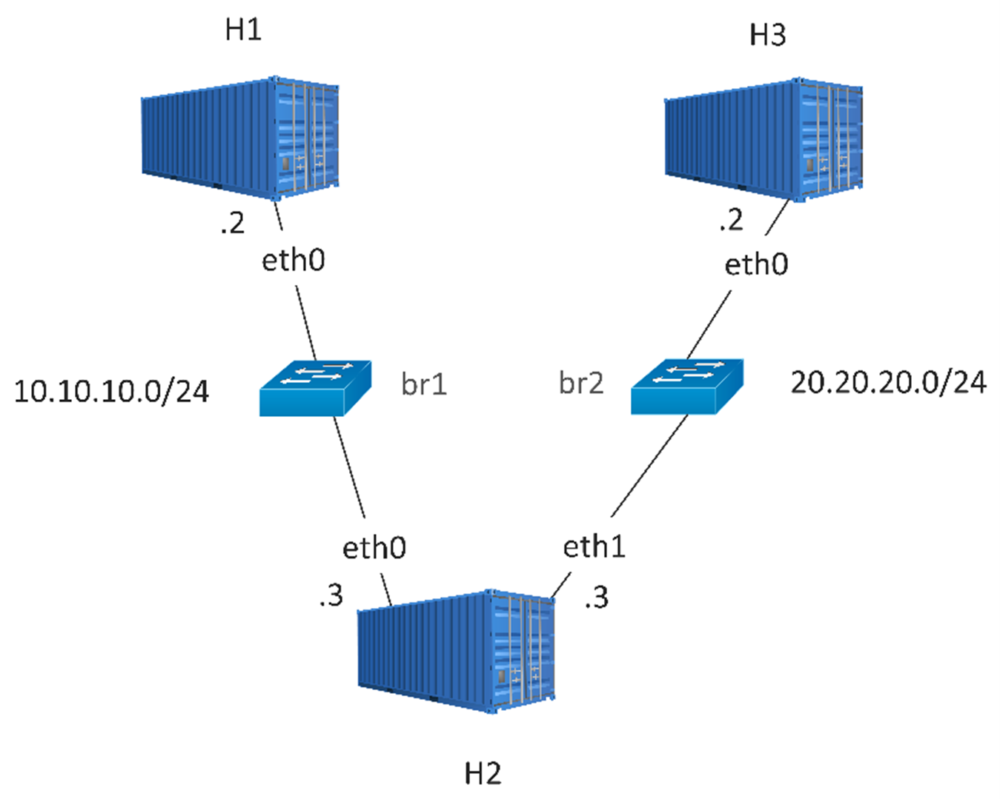

# FRR-LabNet

A hands-on lab for learning dynamic routing with [FRRouting (FRR)](https://frrouting.org/) inside Docker containers. It builds a small three-node network running OSPF, letting you observe route learning, kernel route installation, and end-to-end forwarding — all without physical hardware. The setup is fully automated: build one Docker image, bring up the containers, and OSPF converges on its own.

> For background on FRR architecture, daemons, and installation see [FRRouting.md](FRRouting.md).


## Prerequisites

- **Docker Engine** (v20.10 or later) with the `docker compose` plugin.
- Basic familiarity with the Linux command line.
- No physical routers or switches are needed.


## Key Concepts

This section introduces the foundational ideas used throughout the lab.

### Docker Bridge Networks

Docker can create virtual **bridge** networks that behave like isolated Ethernet switches inside the host. Containers attached to the same bridge can communicate directly, as if they were plugged into the same physical switch. Each container receives a virtual Ethernet interface (named `eth0`, `eth1`, etc.) with an IP address from the bridge's subnet.

### Multi-homed Host

A multi-homed host is a device connected to more than one network simultaneously. It has multiple network interfaces, each on a different subnet. If IP forwarding is enabled, the host can act as a router, passing traffic between its connected networks.

### Loopback Addresses

A loopback interface (`lo`) is a virtual, software-only interface that is always up. Network engineers assign a unique IP address to each router's loopback (e.g., `1.1.1.1/32`) to serve as a stable identifier. Unlike physical interfaces, a loopback never goes down due to cable failures, making it ideal as a router ID for routing protocols like OSPF.

### OSPF at a Glance

OSPF (Open Shortest Path First) is a link-state routing protocol. Instead of simply sharing distance metrics with neighbors (as distance-vector protocols do), each OSPF router floods a description of its own links to every other router in the area. Every router then builds an identical map of the network (the Link-State Database) and independently runs the SPF (Shortest Path First) algorithm to compute the best path to each destination.

Key terms used in this lab:

| Term            | Meaning                                                     |
| --------------- | ----------------------------------------------------------- |
| **Neighbor**    | An adjacent OSPF router that has formed a two-way relationship and exchanges routing information. |
| **Area 0**      | The backbone area. All OSPF routers in this lab belong to Area 0, which is required for any OSPF deployment. |
| **Convergence** | The state in which all routers have a consistent view of the network and agree on the best paths. |
| **DR / BDR**    | On broadcast segments (like our Docker bridges), OSPF elects a Designated Router and a Backup Designated Router to reduce the amount of flooding traffic. |
| **Cost**        | The metric OSPF uses to compare paths. Lower cost is preferred. The default cost is derived from interface bandwidth. |


## Lab Topology

The lab creates three containers connected by two Docker bridge networks:



| Container | Bridge Networks | Interfaces     | Subnets                      | Loopback   |
| --------- | --------------- | -------------- | ---------------------------- | ---------- |
| **H1**    | `br1` only      | `eth0`         | 10.10.10.0/24                | 1.1.1.1/32 |
| **H2**    | `br1` and `br2` | `eth0`, `eth1` | 10.10.10.0/24, 20.20.20.0/24 | 2.2.2.2/32 |
| **H3**    | `br2` only      | `eth0`         | 20.20.20.0/24                | 3.3.3.3/32 |

- **H1** and **H3** each sit on a single network, so they cannot reach each other directly.
- **H2** is the multi-homed host — it has an interface on each bridge and forwards packets between the two subnets once OSPF converges.

Docker Compose creates the two bridge networks (`br1` with subnet `10.10.10.0/24`, `br2` with subnet `20.20.20.0/24`) and assigns IP addresses automatically, so you do not need to configure interface IPs by hand.


## Quick Start

Build the Docker image:

```bash
docker build --tag frr-labnet docker/
```

Start the containers:

```bash
docker compose -f docker/docker-compose.yml up -d
```

OSPF will converge within a few seconds. Jump to [Verify OSPF Convergence](#verify-ospf-convergence) to confirm.


## How the Lab Works

### Pre-loaded Configuration

The OSPF configuration is baked into the Docker image so everything comes up automatically. No manual steps are needed after starting the containers. Here is what happens at startup:

1. The entrypoint script enables IP forwarding (`net.ipv4.ip_forward=1`), which allows H2 to route packets between its two interfaces.
2. It copies the FRR configuration that matches the container's hostname.
3. It starts the FRR service, which launches `zebra` (the route manager) and `ospfd` (the OSPF daemon).

The configuration files live under `docker/configs/`:

```
docker/configs/
├── daemons              # shared — enables zebra and ospfd for all containers
├── frr-h1/frr.conf      # loopback 1.1.1.1, OSPF on 10.10.10.0/24
├── frr-h2/frr.conf      # loopback 2.2.2.2, OSPF on both subnets
└── frr-h3/frr.conf      # loopback 3.3.3.3, OSPF on 20.20.20.0/24
```

Each `frr.conf` tells OSPF which networks to advertise. For example, H2 advertises both `10.10.10.0/24` and `20.20.20.0/24`, so it forms neighbor relationships on both bridges.

### Modifying the Configuration

To change a host's config, edit the corresponding file under `docker/configs/`, rebuild the image, and recreate the containers:

```bash
docker build --tag frr-labnet docker/
docker compose -f docker/docker-compose.yml up -d
```

You can also make live changes by running `vtysh` inside a container (e.g., `docker exec -it H1 vtysh`), but those changes are lost when the container restarts.


## Verify OSPF Convergence

Once OSPF has converged, every router knows the full topology. The steps below confirm this from H1's perspective.

### Check OSPF Neighbors

Enter the H1 container and open the FRR shell:

```bash
docker exec -it H1 vtysh
```

Show OSPF neighbors:

```
frr-h1# show ip ospf neighbor

Neighbor ID     Pri State         Up Time       Dead Time Address         Interface          RXmtL RqstL DBsmL
2.2.2.2           1 Full/DR       9m12s           37.624s 10.10.10.3      eth0:10.10.10.2       0     0     0
```

Reading the output:

- **Neighbor ID `2.2.2.2`** — H2's router ID (its loopback address).
- **State `Full/DR`** — The adjacency is fully established, and H2 is the Designated Router on this segment.
- **Address `10.10.10.3`** — H2's IP on the shared `br1` subnet.

H1 sees only H2 as a neighbor because H1 is connected to `br1` only. H3 is on `br2`, so H1 has no direct OSPF adjacency with H3.

### Examine the Routing Table

Still inside the H1 container:

```
frr-h1# show ip route
```

Example output:

```
Codes: K - kernel route, C - connected, L - local, S - static,
       R - RIP, O - OSPF, I - IS-IS, B - BGP, E - EIGRP, N - NHRP,
       T - Table, v - VNC, V - VNC-Direct, A - Babel, F - PBR,
       f - OpenFabric, t - Table-Direct,
       > - selected route, * - FIB route, q - queued, r - rejected, b - backup
       t - trapped, o - offload failure

K>* 0.0.0.0/0 [0/0] via 10.10.10.1, eth0, weight 1, 00:01:31
O   1.1.1.1/32 [110/0] is directly connected, lo, weight 1, 00:01:31
C>* 1.1.1.1/32 is directly connected, lo, weight 1, 00:01:31
O>* 2.2.2.2/32 [110/10] via 10.10.10.2, eth0, weight 1, 00:00:46
O>* 3.3.3.3/32 [110/20] via 10.10.10.2, eth0, weight 1, 00:00:41
O   10.10.10.0/24 [110/10] is directly connected, eth0, weight 1, 00:01:31
C>* 10.10.10.0/24 is directly connected, eth0, weight 1, 00:01:31
L>* 10.10.10.3/32 is directly connected, eth0, weight 1, 00:01:31
O>* 20.20.20.0/24 [110/20] via 10.10.10.2, eth0, weight 1, 00:00:46
```

How to read the route codes:

| Prefix | Meaning                                 |
| ------ | --------------------------------------- |
| `K`    | Kernel route — installed by the OS (e.g., the default gateway created by Docker). |
| `C`    | Connected — a subnet directly attached to one of this router's interfaces. |
| `L`    | Local — the router's own interface address. |
| `O`    | OSPF — learned dynamically through OSPF. |
| `>`    | Selected route — the best route chosen for this destination. |
| `*`    | FIB route — installed in the kernel forwarding table. |

The numbers in brackets, such as `[110/10]`, represent `[administrative distance/metric]`. OSPF has an administrative distance of 110. The metric (cost) increases with each hop, so `3.3.3.3/32 [110/20]` (two hops away through H2) has a higher cost than `2.2.2.2/32 [110/10]` (one hop away).

Notice that every OSPF-learned route (`O>*`) points to `10.10.10.2` (H2) as the next hop — H2 is H1's only path to the rest of the network.

### Verify Kernel Routes

You can also inspect the Linux kernel's routing table directly. Exit `vtysh` (type `exit`) and run:

```bash
docker exec H1 ip route
```

```
default via 10.10.10.1 dev eth0
2.2.2.2 nhid 10 via 10.10.10.2 dev eth0 proto ospf metric 20
3.3.3.3 nhid 10 via 10.10.10.2 dev eth0 proto ospf metric 20
10.10.10.0/24 dev eth0 proto kernel scope link src 10.10.10.3
20.20.20.0/24 nhid 10 via 10.10.10.2 dev eth0 proto ospf metric 20
```

The entries marked `proto ospf` confirm that FRR's Zebra daemon programmed these routes into the Linux kernel via Netlink, exactly as described in [FRRouting.md](FRRouting.md).


## Test End-to-End Connectivity

With OSPF converged and IP forwarding enabled on H2, H1 can reach H3 through H2.

Ping H3's loopback from H1:

```bash
docker exec H1 ping -c 3 3.3.3.3
```

Ping H1's loopback from H3:

```bash
docker exec H3 ping -c 3 1.1.1.1
```

Both should succeed, confirming the full routing path: **H1 → H2 → H3**.


## Cleanup

To stop and remove the containers and networks:

```bash
docker compose -f docker/docker-compose.yml down
```
